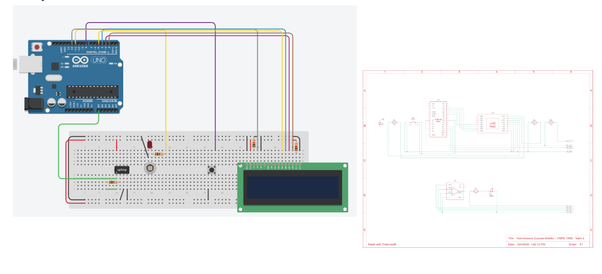

# Prick-Less

Because nobody likes PRICKS

## Non-Invasive Glucose Monitoring System

A cutting-edge project aimed at developing a non-invasive, AI-assisted device to monitor blood glucose levels painlessly. This system leverages optical sensing with a photoresistor and LED, combined with machine learning to estimate glucose levels and provide actionable lifestyle insights.

## Table of Contents

- [Overview](#overview)
- [Background](#background)
- [Features](#features)
- [Hardware Components](#hardware-components)
- [Software Components](#software-components)
- [Design & Methodology](#design--methodology)
- [Setup & Installation](#setup--installation)
- [Research](#research)

## Overview

The Non-Invasive Glucose Monitoring System is designed to offer a pain-free alternative to traditional blood glucose meters and continuous subcutaneous monitors. By using an LED light and a photoresistor placed on either side of a finger, the device measures light absorption changes through the tissue. This information is then processed with machine learning algorithms to determine glucose levels and track lifestyle factors that influence blood sugar.

## Background

Traditional glucose monitoring methods are invasive and can be particularly challenging for elderly patients and those with chronic conditions like diabetes. This project is driven by the need for a non-invasive solution that:

- Reduces discomfort and pain associated with finger pricking or implanting sensors.
- Provides continuous, real-time monitoring of blood glucose levels.
- Integrates actionable insights based on lifestyle data to better manage diabetes.

## Features

### Non-Invasive Sensing

Uses optical methods to measure glucose levels without breaking the skin.


### Real-Time Monitoring

Delivers instantaneous glucose readings and trend analysis.


### AI-Assisted Analysis

Machine learning models analyze the sensor data for accurate glucose estimation.


### User-Friendly Interface

Displays current levels, historical trends, and personalized recommendations.


### Portable & Ergonomic Design

Compact design optimized for ease-of-use, especially for elderly users.



## Hardware Components

- **LED Light Source:**
  - Selected for its stability and suitable wavelength (e.g., near-infrared) that interacts with interstitial fluid.
- **Photoresistor/Photodiode:**
  - Sensitive enough to detect variations in transmitted light after passing through the finger.
- **Signal Conditioning Circuitry:**
  - Includes amplification and filtering stages to manage noise and ambient light interference.
- **Analog-to-Digital Converter (ADC):**
  - High-resolution ADC for accurate digitization of sensor data.
- **Microcontroller/Embedded System:**
  - Handles data acquisition, controls the LED, and interfaces with the machine learning software.
- **Ergonomic Finger Clip:**
  - A custom-designed housing ensuring consistent sensor placement and reliable measurements.

## Software Components

- **Data Acquisition Module:**
  - Interfaces with hardware to collect and preprocess sensor data.
- **Signal Processing Algorithms:**
  - Noise reduction and baseline correction techniques to improve data quality.
- **Machine Learning Pipeline:**
  - Feature extraction from optical data.
  - Model training using regression techniques and neural networks to predict glucose levels.
  - Real-time inference integrated into the embedded system.
- **User Interface:**
  - Displays real-time glucose levels, historical trends, and alerts for hypo- or hyperglycemia.
- **Data Logging & Analytics:**
  - Stores historical data for trend analysis and further model refinement.

## Design & Methodology

The system design is based on a non-invasive optical measurement technique:

1. **Optical Sensing:**
   An LED light shines through the finger while the photoresistor on the opposite side measures light attenuation. Variations in light absorption are influenced by glucose concentration in the interstitial fluid.
2. **Data Processing:**
   The raw sensor output is conditioned and digitized. Signal processing algorithms filter noise and account for variables such as ambient light.
3. **Machine Learning Integration:**
   A trained model correlates the processed optical data with actual blood glucose levels. Continuous learning allows the system to adapt to individual user characteristics.
4. **User Feedback:**
   A user-friendly interface presents the measured glucose levels, trends, and personalized health recommendations, aiming to support effective diabetes management.

## Setup & Installation

1. **Dependencies:**

- Setup Node.js/Express Server Dependencies

```
npm install express cors body-parser dotenv
npm install --save-dev nodemon
```

- MQTT client for real-time readings from ESP-32

```
npm install mqtt
```

- MySQL dependencies

```
npm install mysql2
```

1. **Setup Backend**

- MySQL database setup

```
create database glucose_monitor;
use glucose_monitor;
```

### Hardware Setup

1. **Assemble the Device:**
   - Mount the LED and photoresistor on opposite sides of the custom finger clip.
   - Connect the signal conditioning circuit and ADC to the microcontroller.
2. **Power Supply:**
   - Ensure a stable power source is provided, either through batteries or a direct power supply.

### Software Setup

1. **Clone the Repository:**

   ```bash
   git clone https://github.com/yourusername/Prick-Less.git
   cd Prick-Less

   ```

### Acknowledgements

We would like to extend our deepest gratitude to Dr. Mark Ammar Rayes, our project advisor, for his invaluable guidance and mentorship throughout this project. We also wish to thank Dr. Wencen Wu, our professor, for providing us with the knowledge and framework necessary to successfully complete this work. Additionally, we are grateful to Dr. Gregory Courand, the GE coordinator, for his support and coordination. Finally, we acknowledge San Jose State University for providing us the opportunity and resources to carry out this project.

### Research

Research that is helping drive this project:

Saputra, Dika Ari, and J. Rajes Khana. "Design and Development of Esp32-Based Non-Invasive Blood Sugar Level Measurement Equipment." Proceedings of the 3rd International Seminar and Call for Paper (ISCP) UTA'45 Jakarta, 2022, pp. 381-385.

Wu, Juncen, et al. "A New Generation of Sensors for Non-Invasive Blood Glucose Monitoring." American Journal of Translational Research, vol. 15, no. 6, 15 June 2023, pp. 3825–3837.

Alam, Iftekar, et al. "Design and Development of a Non-invasive Opto-Electronic Sensor for Blood Glucose Monitoring Using a Visible Light Source." Cureus, vol. 16, no. 5, 21 May 2024, e60745, doi:10.7759/cureus.60745.

Hina, Aminah, and Wala Saadeh. “Noninvasive Blood Glucose Monitoring Systems Using Near‑Infrared Technology—A Review.” Sensors, vol. 22, no. 13, 27 June 2022, p. 4855, https://doi.org/10.3390/s22134855.

Saleem, Muhammad Yasir, and Muhammad Ammar. Dataset of Photoplethysmography Signals Collected from a Pulse Sensor to Measure Blood Glucose Level. Mendeley Data, vol. 1, 2022, https://data.mendeley.com/datasets/37pm7jk7jn/1.

Mosaddequr, Kazi, and Tanzilur Rahman. "A Novel Multipurpose Device for Dataset Creation and On-Device Immediate Estimation of Blood Glucose Level from Reflection PPG." Heliyon, vol. 9, no. 9, 2023, e19553.

Satter, Shama, et al. "EMD-Based Noninvasive Blood Glucose Estimation from PPG Signals Using Machine Learning Algorithms." Applied Sciences, vol. 14, no. 4, 2024, p. 1406.
